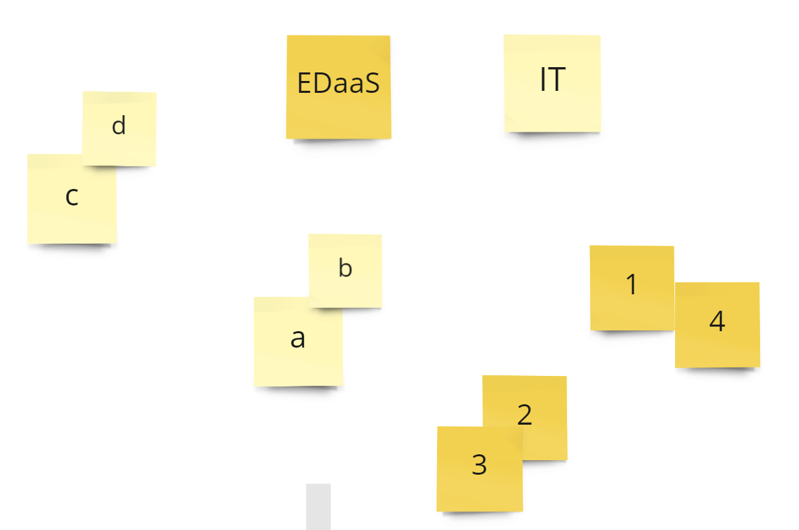
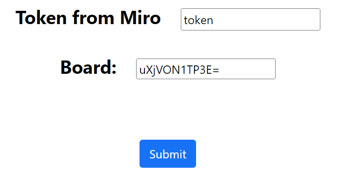
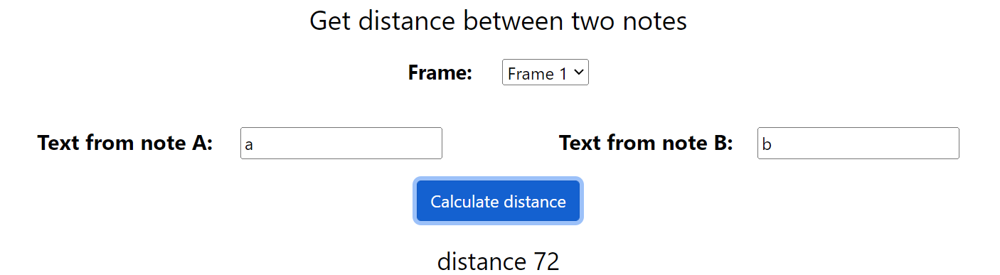
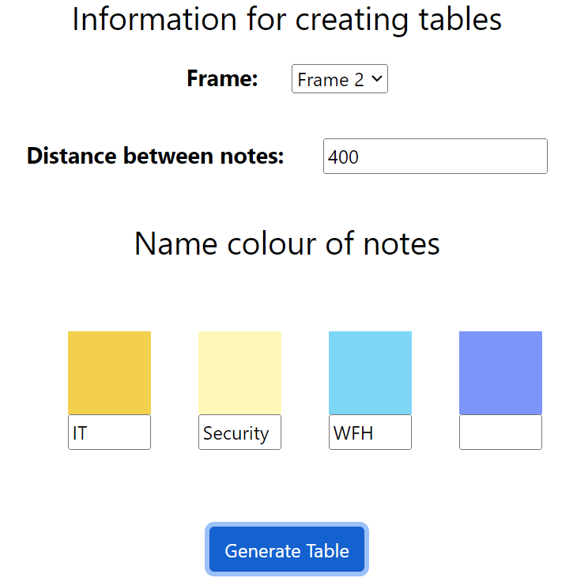
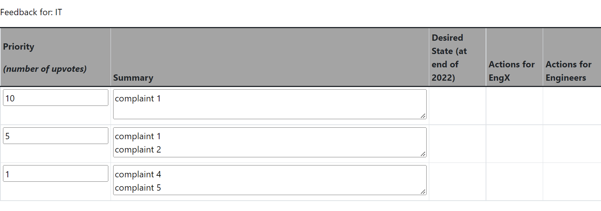

## What is MiroNotesToTables?

## How to use MiroNotesToTables?

MiroNotesToTables will create an Confluence HTML code snippet out of the grouped sticky notes in Miro.

Open this project in GitPod for instantaneous development and usage!

Each cluster of grouped notes as seen in a image would be counted as a row and each colour is a different table

To generate HTML table out of grouped sticky notes in Miro follow these steps:

1. type in your Miro token and the board ID(board ID is not what you named it, it is text after `/board/` in your URL link to the board eg: `https://miro.com/app/board/uXjVON1TP3E=/`)

1. As the distance between notes might be different each time due to scaling, you can check what is the distance between 2 notes within on frame. To do that, select the frame where the notes are and copy paste the text from each note to `note A` and `note B`

1. Then you need to specify not groupings and colors. Start by specifying the frame you want to work with, then the max distance between grouped notes. You'll see all of the used note colours within the frame listed below with text boxes underneath, each colour represents a table and if you specify a name to the the color that will be the tables name, if you do not specify a name, then that colour will not have any tables and will be ignored.
Eg I have 4 colours, orange notes were used for IT so I will write `IT` in the TextBox, light yellow was for Security and light blue was for WFH, but purple was used for comments so I don't want any tables or info regarding purple notes. 

1. After clicking `Generate Table` tables will be create. Each row symbolize a cluster of notes
